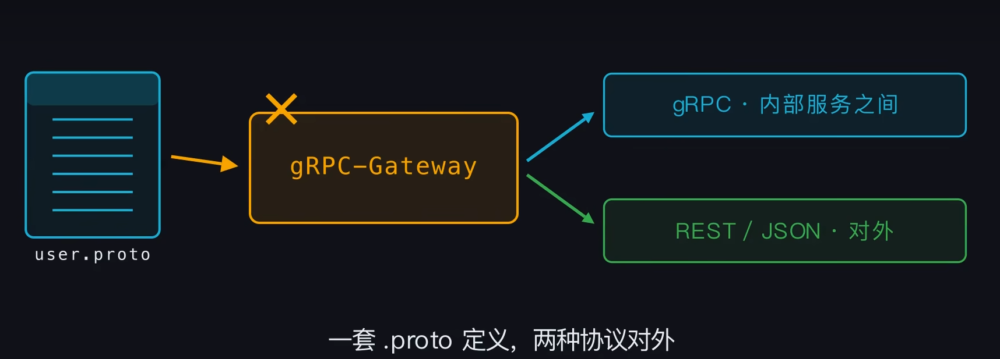

<!-- introduction -->
gRPC
<!--more-->
# GRPc

## RPC 
**Remote Procedure Call** 远程过程调用
封装网络请求，rpc负责打包参数，网络传输和解析回复

## GRPC
GRPC是google封装的rpc协议，通过protocol buffer和HTTP/2实现高效传输

protocol buffer 负责定义数据结构
proto的message里面真正二进制存储的是编号，字段修改不影响兼容

```bash
#name.proto
message Name{
    int id = 1;
    string n = 2;
}

service NameService{
    rpc *** return **
}
```
protoc生成框架，包括客户端stub和服务器接口，客户端封装包括封装，发送，接收，，服务器只需要实现对应接口函数

## 过程
- 客户端先创建一个从客户端到服务器的长连接，这个连接可以复用，不用每次都握手。然后创建stub，像调取本地方法一样发起调用。
- stub先用protobuf把请求对象序列化成二进制，再包装成Http/2的数据帧，顺着已有的连接发出去
- 服务端收到帧，反序列化成对象，路由到实现的方法
- 方法执行完之后封装，序列化，原路回传

## 优点

HTTP：HTTP1一条连接同一时间只能处理一个请求，其他请求阻塞，只能多开连接来缓解。HTTP/2把多个数据切成帧，每个帧带着自己的请求和编号，多个请求可以同时跑在一条连接上，互相不阻塞。同时长连接复用减少了大量的握手开销。
protocol buffer

## 形式
- 一元调用：一个请求对应一个响应，类比普通函数调用
- 服务端流：客户端只发一次，服务端连续返回很多条，适合订阅，历史消息等
- 客户端流：客户端发送很多条消息，服务器最后返回一个结果，适合文件上床，汇总等
- 双向流：两边随时发送，长连接，保持接收，适合聊天，实时推送
四种模式公用一条HTTP长连接

## metadata
存放需要往下游传得数据类型，比如token，链路追踪的trace_id
## Deadline
上下游可以共用一个终点，到点没完成所有游上的链路都停止

## 拦截器
grpc中相当于中间件，包在真正的调用外面，请求进出都需要经过。

## 其他
GRPC内置TLS，创建长连接时指定凭证
客户端自动负载均衡+重试
GRPC-Gateway一套proto定义，两种协议对外
