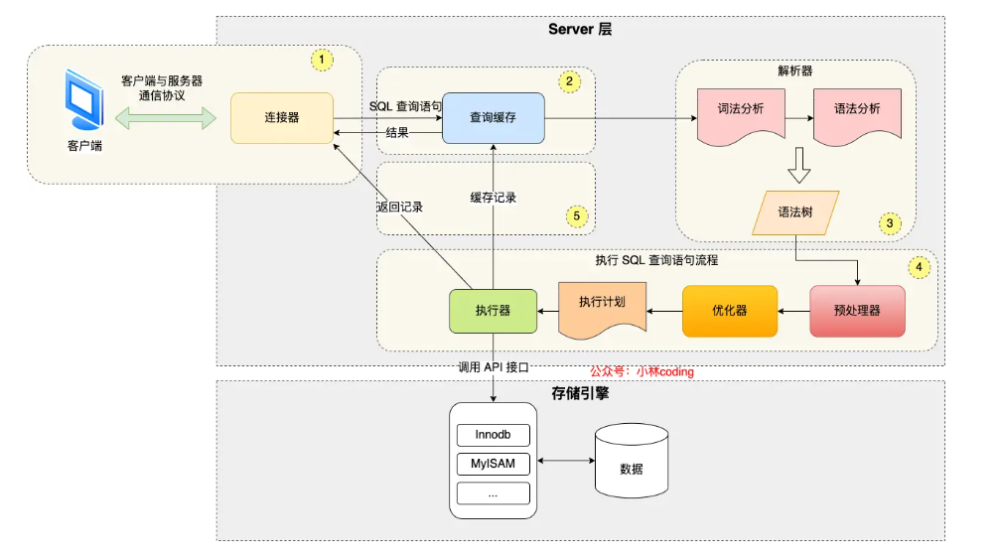

<!-- introduction -->
关于MySQL引擎
<!--more-->
# MySQL里面的引擎是什么？
存储引擎决定 MySQL 如何存储数据、建立索引、读写数据以及是否支持事务、锁等功能。

# MYSQL执行一条语句的过程

连接器：建立连接，校验连接，管理连接
1. 查询缓存：如果命中缓存直接返回，否则继续查询。MySQL8.0版本后已经删除
2. 解析SQL：通过解析器对SQL查询进行语法分析，建立语法树。语法树是对SQL语句的结构化分析，根据不同的token拆分。
优化器会基于这个树判断有没有索引？使用索引是否划算？然后综合成本更低的执行计划
3. 执行SQL：
   - 预处理阶段：检查表或者字段是否存在，将*扩展为表上的所有列
   - 优化阶段，基于执行的成本考虑，选择执行成本最小的方式
   - 执行阶段：根据执行计划执行SQL查询语句，从存储引擎读取记录，回传客户端
  
# InnoDB
MySQL主要有三种引擎：
- InnoDB：MySQL默认存储引擎，具有ACID特性，支持行锁，事务，外键约束。适用于高并发的读写，数据完整性和并发较强。支持崩溃恢复。
- Memory：Memory引擎将数据存在内存中，不支持事务，行锁，外键约束。重启数据会丢失。默认使用hash索引。
- MyISAM：适合大量读的操作，存储空间和内存消耗低。不支持事务，行锁，外键约束。

## 为什么 InnoDB 比 Memory 更适合高并发
1. InnoDB并发控制能力强，通过行级锁保证对同一张表的不同行并发操作。Memory不支持行级锁，导致高并发下很难处理事务
2. InnoDB可以实现MVCC，实现修改数据的时候读到未修改的历史版本，从而实现读写并发
3. InnoDB可以实现事务支持，保证并发下的正确性，Memory没有这些原生支持，并发下保持一致性成本比较高
## MyISAM
MyISAM是非聚簇索引，索引存的是指向索引的指针