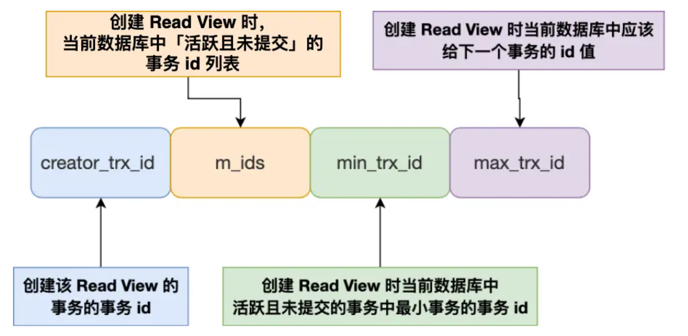

<!-- introduction -->
关于SQL事务
<!--more-->
# 事务
事务是一组操作的集合，事务把所有操作作为一个整体向系统提交请求，这些操作要么全部成功，要么全部失败。
## 事务的特性（ACID）
- A原子性：一组事务要么全部成功要么全部失败
- C一致性：事务完毕时，所有的数据都保证一致状态
- I隔离性：数据库的隔离机制，确保事务不受其他并发请求的影响
- D持久性：事务一旦提交，对数据的修改是永久的

MySQL通过不同的方式来保证这四个特性：
原子性：undo log
一致性：通过原子性+隔离性+持久性来保证
隔离性：mvcc，锁机制
持久性：redo log

## 并发事务
脏读：读取到另一个事务还没有提交的数据
> 场景：AB同时查修改一个建，A查后修改这个键，但是本次事务还没有提交，B已经读到A修改之后的值了，如果A提交失败回滚，那么这个B读到的这个建就是过期的数据，这就是脏读

不可重复读：一个事务前后两次读取同一个数据但是结果不同

> 场景：AB同时查修改一个建，A查后修改这个键，但是B的查改更快，并且提交了事务，那么在A修改这个键的时候，会发现建的值已经不一样了，出现了前后两次读建不一样的问题，这种现象叫作不可重复读

幻读：一个事务内查询符合条件的记录条数，前后两次数量不一致，和不可重复读不一样的点在于不可重复读是针对一行数据update，而幻读是insert或者delete了一行

> 场景：AB同时查询age大于10的行，A查询到有4行，B也查询到有4行，A插入了一行，此时B查询变为5行，好像产生了幻觉，这就是幻读
解决方法：事务隔离级别

MySQL如何解决上述并发问题？主要是通过如下三个机制：
- 锁机制：MySQL的InnoDB和MYIsam都支持**表级锁**，InnoDB额外支持**行级锁**（除了被移除的BDB均不支持页级锁）。
- MVCC保证不同事务之间的隔离性，根据事务的隔离等级来选择合适的数据版本，保证数据的一致性
- 事务隔离等级，MYSQL通过多个事务隔离等级，在事务并行的时候控制事务的隔离等级，避免数据不一致的情况
  
## 事务隔离级别
事务隔离级别本质是并发性能和数据一致性之间的取舍

read uncommited读未提交：基本不提供隔离
read commited读已提交：只能读到其他事务已经提交的数据。使用mvcc解决——避免脏读
repeated read可重复读：同一个事务中的普通一致性读，看到的是一致的快照——避免脏读和不可重复读
serlalizable串行化：让并发事务表现的像一个一个执行，通过严格的锁约束限制并发访问——避免幻读，脏读和不可重复读

MySQL的默认隔离等级是可重复读

这四种隔离等级的实现是：
- 针对[读未提交]：直接读最新数据
- 对于[串行化]:通过读写锁防止并发访问
- 对于[读提交]和[可重复读]:通过read view来实现。区别在于read view创建时机的不同
  [读提交]在每个select语句执行前都生成一个read view
  [可重复读]在每个事务前生成一个read view

> read view是什么？
  
read view维护这样四个数据
- m_id:在创建read view的时候，当前数库中活跃的事务id列表。其中活跃事务指的是启动了但是还没有提交的事务
- min_trv_id:活跃事务中最小id最小的事务
- max_trv_id:创建read view的时候该给下一个事务的id，全局事务最大值+1
- create_trv_id:创建这个事务的id

在一个事务到来的时候，先对事务的id进行判断，如果小于最小活跃事务id，证明修改这个数据的事务早就提交了，那么可以查看。如果大于最大活跃事务id，那么证明这个数据的事务还没有提交，此时不允许查看。介于两个数中间的事务id就去活泼列表里面找，如果不在活跃列表里面，证明事务已经提交，可以查看否则要用到undolog找历史版本事务，再判断是否可见，直到找到一个可见的版本

MySQL的MVCC就是通过这样的版本链来实现的。