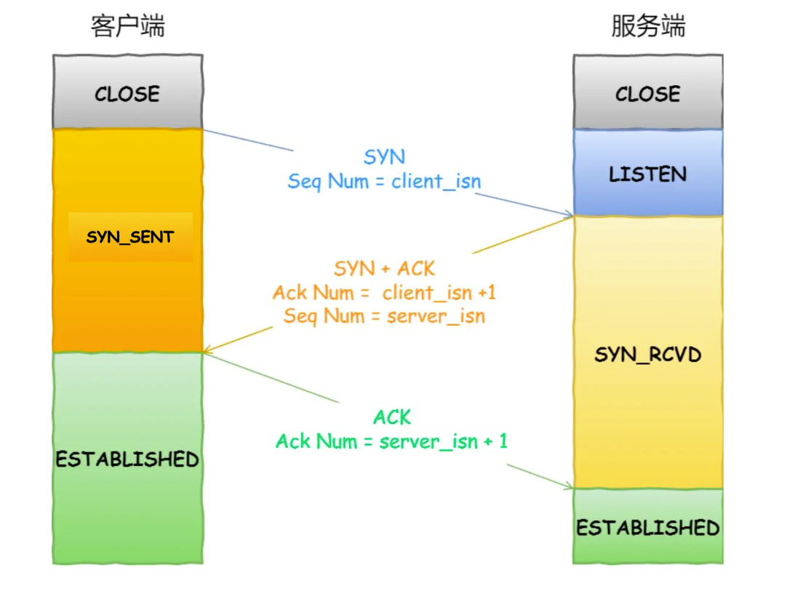

<!-- introduction -->
关于TCP——三次握手与四次挥手
<!--more-->
# TCP 是什么
TCP是传输层一种面向连接，可靠的字节流传输

网络本身不能保证数据的不可重复，丢失，按照顺序，一定到达，TCP可以解决这些问题

## TCP和UDP区别
TCP是面向连接的传输层协议，UDP不需要连接即时传递数据
TCP是一对一的两点服务，UDP支持一对一，一对多，多对多的交互通信
TCP保证数据的可靠，保证数据不重复到达，不丢失，按照顺序到达，UDP不可靠
TCP有流量控制和拥塞控制，数据特别多的时候
TCP是流式传输，没有边界，但是保证顺序和可靠，UDP是包传输

# TCP的维护传输稳定的方法
## 三次握手

### 为什么是三次握手
- 避免历史连接：两次握手只有在一端发起rst的时候才知道不能发送数据了，会白白发送一些数据
- 同步双方初始序列号
- 避免资源浪费

超时重传的时候如果超过最大重传次数，未收到就会断开连接
## 拥塞控制
拥塞控制主要是解决大量数据传输时网络阻塞，导致数据丢包，一端大量重试，导致网络负担更重。TCP的拥塞控制防止发送方的数据填满整个网络
发送窗口是接收窗口(swnd)和接收窗口中(rwnd)的最小值，当网络没有出现拥塞的时候，拥塞窗口增大，反之拥塞窗口减小
一般只要发送方没有在规定时间内收到ACK返回，就认为是网络超时
拥塞控制主要是四种算法
- 慢启动：
  TCP建立连接完成之后，每次收到一次ACK，就扩大一次拥塞窗口，当到达慢启动门限的时候，触发拥塞避免算法
- 拥塞避免
  进入拥塞避免之后，每次收到一个ACK，拥塞窗口扩大 1/cwnd，如果触发重传机制，则进入拥塞发生
- 拥塞发生
  超时重传：慢启动门限降为1/2，cwnd大小恢复初始值
  快速重传：cwnd变为1/2，慢启动门限变为cwnd大小，触发快速恢复
- 快速恢复
  重传丢失数据包，再次进入拥塞避免状态