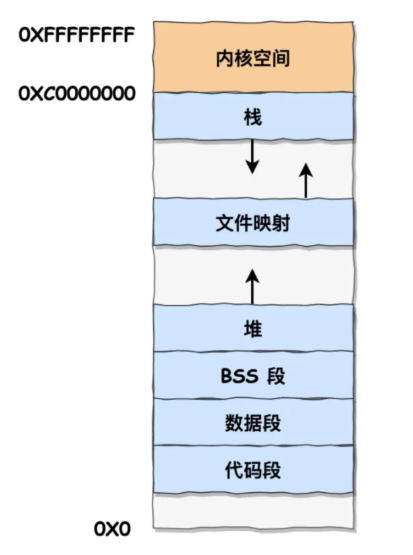

<!-- introduction -->
《操作系统真相还原》学习笔记：保护模式核心概念，段描述符、GDT、选择子，以及打开保护模式的三个步骤。
<!--more-->

## bits 指令

`bits` 决定汇编器生成哪种机器码。

- `[bits 16]` — 编译成 16 位机器码
- `[bits 32]` — 编译成 32 位机器码
- 未指定时默认为 `[bits 16]`

## 前缀 0x66 和 0x67

**0x66：切换操作数大小**

- 16 位实模式下，操作数大小变为 32 位
- 32 位保护模式下，操作数大小变为 16 位

**0x67：寻址方式反转**

想在 32 位模式下使用 16 位内存寻址（如 bx），需加 0x67 前缀；16 位模式同理。

## 段描述符

一个段描述符只用来定义一个内存段。结构如下：



| 字段 | 含义 |
|------|------|
| G | 段界限粒度：0=字节，1=4KB |
| D/B | 有效地址及操作数大小 |
| L | 64 位代码段标记（32 位下为 0） |
| AVL | 用户自定义 |
| P | 段是否在内存中 |
| DPL | 特权级：0=内核，3=用户 |
| S | 0=系统段，1=非系统段（代码/数据段） |


## 全局描述符表 GDT

- 存放段描述符的表，位于内存中
- 用专用寄存器 **GDTR** 存储 GDT 的地址和大小
- 最多定义 **8192** 个描述符

## 选择子

用于确定段描述符在 GDT/LDT 中的索引位置。


| 字段 | 含义 |
|------|------|
| RPL | 请求特权级：0=高权限，3=低权限（用户级） |
| TI | 0=GDT，1=LDT |

## 打开保护模式三步

```
1. 加载全局描述符表（lgdt 指令，48 位内存操作数）
2. 打开 A20 Gate，关闭地址回绕
3. 将 CR0 的 PE 位 置为 1
```
